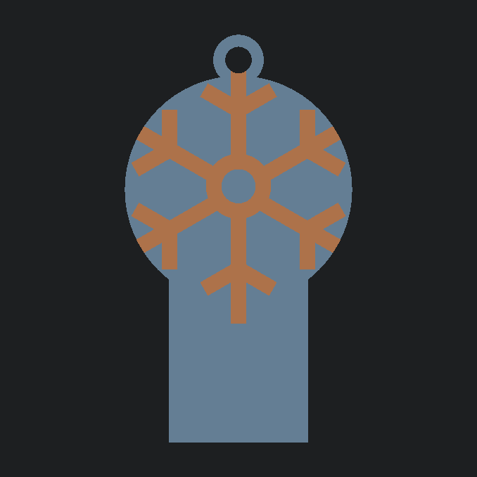

# Frost Bite - Can Tab Opener & Keychain

A compact, parametric can tab opener and keychain engineered to slide over soda and beverage tabs for easy, leverage-assisted opening without fingernail strain. Designed with a clean flat profile for single-color debossed printing or two-tone multi-color flush/embossed variants.

<!-- markdownlint-disable MD033 -->

    

<!-- markdownlint-enable MD033 -->

## 🏆 Contest Entry

This model was designed and submitted as part of the **[Creality Cloud Bottle & Can Opener Contest](https://www.crealitycloud.com/contest/Bottle-Can-Opener)**.

- **Host:** Creality Cloud
- **Category:** Everyday Carry / Functional Utility
- **Design Goals:** High leverage-to-weight ratio, 100% 3D printable without supports, pocketable form factor with keychain retention.

## 📥 Download & Print Profiles

Pre-configured `.3mf` production project files and individual `.stl` files are organized in the [`models/`](./models/) directory:

- **Single Color:** [`models/single/`](./models/single/) — Debossed snowflake emblem, zero color swaps required.
- **Multi-Color Flush:** [`models/multi-color-flush/`](./models/multi-color-flush/) — Completely flat top surface with inlaid two-tone snowflake.
- **Multi-Color Embossed:** [`models/multi-color-embossed/`](./models/multi-color-embossed/) — Raised 0.6 mm tactile snowflake emblem.

Also available on creator communities:

- [Creality Cloud Model Page](https://www.crealitycloud.com/)
- [MakerWorld](https://makerworld.com/)
- [Printables](https://www.printables.com/)

## 🖨️ Recommended Print Settings

### Universal Structural Specs (All Variants)

Optimized for durability under leverage and clean bridging inside the internal tab sleeve:

- **Material:** PETG, PLA+, or Rapid PLA+ (PETG or PLA+ recommended for functional leverage)
- **Layer Height:** 0.20 mm
- **Wall Loops:** 4 walls (critical for mechanical strength along the tab slot and keyring eyelet)
- **Top / Bottom Shells:** 5 top layers, 4 bottom layers
- **Infill:** 25%–30% Gyroid
- **Supports:** None (oriented flat on the build plate; horizontal tab slot bridges cleanly across 16 mm)
- **Brim:** None required on clean PEI/textured sheets

### Multi-Color Print Profiles (CFS / AMS)

When printing the Flush or Embossed variants:

- **Prime Tower:** Enabled (Width: 35 mm, Brim: 5 mm).
- **Sparse Layers:** Enable **"No sparse layers (beta)"** to eliminate empty tower layers for the first 4.2 mm, saving filament and print time.
- **Top Surface Pattern:** `Monotonic` or `Monotonic Line` for a clean, uniform finish around the snowflake inlay.
- **Purge / Flushing Volume:** Set Black-to-White/Cyan transition to at least **250–300 mm³** to avoid dark color bleeding into the snowflake arms.

## 🔩 Hardware Required

100% 3D printed — no hardware required. The eyelet fits standard 20–25 mm split keyrings.

## 🛠️ Customizing with OpenSCAD

Frost Bite is fully parametric. You can adjust fit tolerances, external dimensions, and export dedicated parts using `frost-bite.scad`.

**Key Variables:**

- `PART` — Geometry mode: `"single"` (debossed single-material), `"assembly"` (multi-color preview), `"body"` (chassis export), or `"snowflake"` (emblem insert export)
- `LOGO_STYLE` — Emblem depth mode: `"flush"` (inlaid smooth top) or `"embossed"` (raised 0.6 mm above top surface)
- `SLOT_W` — Can tab pocket width (Default: `16.0 mm`)
- `SLOT_H` — Tab slot clearance height (Default: `2.2 mm`)
- `SLOT_DEPTH` — Insertion depth for can tab (Default: `24.0 mm`)
- `HEAD_D` — Circular emblem diameter (Default: `36.0 mm`)
- `THICKNESS` — Overall body thickness (Default: `5.0 mm`)
- `EYELET_ID` — Keyring hole diameter (Default: `4.2 mm`)

_To export your own multi-material files:_

1. Set `PART = "body";` and render (`F6`) $\rightarrow$ Export `frost-bite-[style]-body.stl`.
2. Set `PART = "snowflake";` and render (`F6`) $\rightarrow$ Export `frost-bite-[style]-snowflake.stl`.
3. Load both `.stl` files simultaneously into your slicer as a single multi-part object.

## 🧩 Usage Instructions

1. Slide the bottom rectangular slot over the beverage pull tab until fully seated.
2. Lift upwards using the circular snowflake handle for effortless leverage.
3. Attach to your keychain through the integrated top eyelet for everyday carry.

---

_Part of the [Cold Front Forge](https://github.com/OneBuffaloLabs/ColdFrontForge) open-source collection. Licensed under CC BY-NC-SA 4.0._

_Looking for finished physical prints or custom colors? Visit our shop: [coldfrontforge.etsy.com](https://coldfrontforge.etsy.com)_
