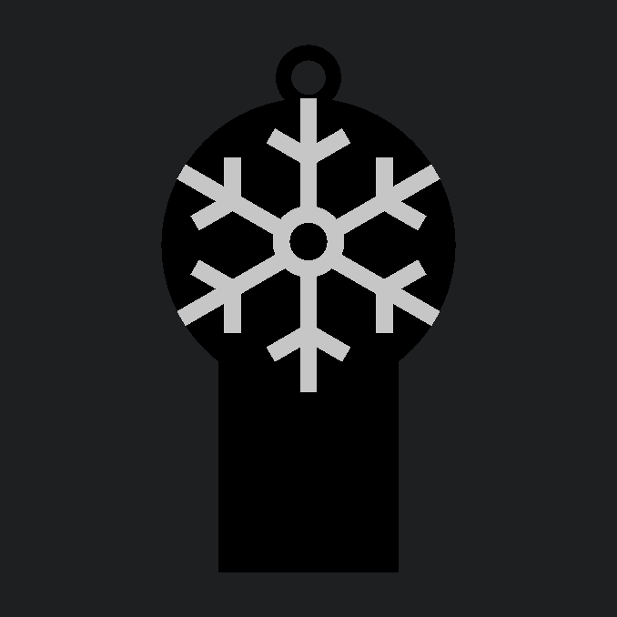

# Frost Bite - Can Tab Opener & Keychain

A compact, parametric can tab opener and keychain engineered to slide over soda and beverage tabs for easy, leverage-assisted opening without fingernail strain. Designed with a clean flat profile for single-color debossed printing or two-tone multi-color flush/embossed variants.

<!-- markdownlint-disable MD033 -->

    

<!-- markdownlint-enable MD033 -->

## 🏆 Contest Entry

This model was designed and submitted as part of the **[Creality Cloud Bottle & Can Opener Contest](https://www.crealitycloud.com/contest/Bottle-Can-Opener)**.

- **Host:** Creality Cloud
- **Category:** Everyday Carry / Functional Utility
- **Design Goals:** High leverage-to-weight ratio, 100% 3D printable without supports, pocketable form factor with keychain retention.

## 📥 Download & Print Profiles

Pre-sliced `.3mf` files and optimized print profiles:

- [Creality Cloud Model Page](https://www.crealitycloud.com/)

## 🖨️ Recommended Print Settings

Optimized for durability under leverage and clean bridging inside the internal tab sleeve:

- **Material:** PETG, PLA+, or Rapid PLA+ (PETG or PLA+ recommended for functional leverage)
- **Layer Height:** 0.20 mm
- **Infill:** 25%–30% Gyroid
- **Wall Loops (Perimeters):** 4 walls (crucial for structural rigidity along the tab sleeve and keyring eyelet)
- **Top/Bottom Layers:** 5 top, 4 bottom
- **Supports:** None required (oriented flat on the build plate; the internal horizontal slot spans 16 mm with clean bridging)
- **Brim:** Not needed on PEI or clean build surfaces

## 🔩 Hardware Required

100% 3D Printed - No extra hardware needed! Fits standard 20–25 mm split keyrings.

## 🛠️ Customizing with OpenSCAD

Frost Bite is fully parametric and includes multi-color part generation. You can adjust fit tolerances, external dimensions, and export dedicated parts using `frost-bite.scad`.

**Key Variables You Can Change:**

- `PART` - Geometry mode: `"single"` (debossed single-material), `"assembly"` (multi-color preview), `"body"` (main chassis STL export), or `"snowflake"` (logo insert STL export)
- `LOGO_STYLE` - Logo configuration for multi-material prints: `"flush"` (inlaid smooth top) or `"embossed"` (raised 0.6 mm above the top surface)
- `SLOT_W` - Can tab pocket width (Default: `16.0 mm`)
- `SLOT_H` - Tab slot clearance height (Default: `2.2 mm`)
- `SLOT_DEPTH` - Insertion depth for can tab (Default: `24.0 mm`)
- `HEAD_D` - Circular emblem diameter (Default: `36.0 mm`)
- `THICKNESS` - Overall body thickness (Default: `5.0 mm`)
- `EYELET_ID` - Keyring hole internal diameter (Default: `4.2 mm`)

_To export separate files for multi-material printing:_

1. Set `PART = "body";`, press `F6` to render, and export `frost-bite-body.stl`.
2. Set `PART = "snowflake";`, press `F6` to render, and export `frost-bite-snowflake.stl`.
3. Load both `.stl` files simultaneously into your slicer as a single multi-material object.

## 🧩 Usage Instructions

1. Slide the bottom rectangular sleeve over the pull tab of any standard beverage can until fully seated.
2. Lift upwards using the circular snowflake handle for effortless leverage.
3. Attach to your keychain through the integrated top eyelet for everyday carry.

---

_Part of the [Cold Front Forge](https://github.com/OneBuffaloLabs/ColdFrontForge) open-source collection. Licensed under CC BY-NC-SA 4.0._

_Looking for finished physical prints or custom colors? Visit our shop: [coldfrontforge.etsy.com](https://coldfrontforge.etsy.com)_
