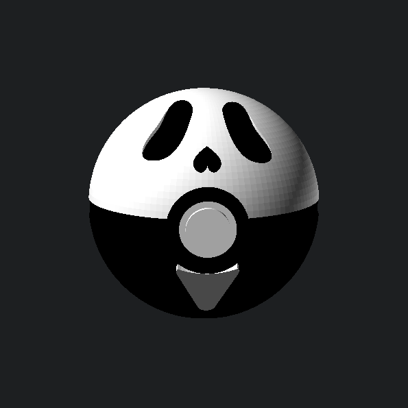

# Slasher Spheres: Ghostface Sphere

A multi-part, support-free display sphere merging classic creature-catching geometry with the haunting visage of Ghostface from the _Scream_ franchise. Engineered in OpenSCAD for glue-free friction assembly, featuring deep recessed eye and nose sockets for natural shadow depth, an integrated mouth pocket, and a flattened base for shelf stability.

<!-- markdownlint-disable MD033 -->

    

<!-- markdownlint-enable MD033 -->

## 📥 Download & Print Profiles

Pre-configured print files and component meshes are organized in the [`models/`](./models/) directory:

- **Shell Components:**
  - `models/ghostface-ball-top.stl` — White upper hemisphere with recessed eye and nose pockets.
  - `models/ghostface-ball-bottom.stl` — Black lower hemisphere with flattened display base and mouth pocket.
  - `models/ghostface-ball-ring.stl` — Black center equatorial dividing band.
- **Internal Core & Button:**
  - `models/ghostface-ball-filler.stl` — Rectangular internal alignment core peg.
  - `models/ghostface-ball-front-ring.stl` — Outer button bezel housing.
  - `models/ghostface-ball-button.stl` — Stepped center red button actuator.
- **Detail Chips (Face Inserts):**
  - `models/ghostface-chips-black.stl` — Black eye and nose inserts (recessed shadow fit).
  - `models/ghostface-chips-white.stl` — White rounded triangle mouth insert with top bezel clearance cutout.

Also available on creator platforms:

- [MakerWorld](https://makerworld.com/en/models/3215177-slasher-spheres-ghostface)
- [Printables](https://www.printables.com/model/1822409-slasher-spheres-ghostface)
- [Creality Cloud](https://www.crealitycloud.com/model-detail/slasher-spheres-ghostface)

## 🖨️ Recommended Print Settings

### Structural & Shell Settings

- **Material:** PLA or PETG.
- **Layer Height:** 0.20 mm.
- **Wall Generator:** **Arachne (Mandatory)** to properly resolve thin perimeters around facial sockets.
- **Wall Loops:** 3–4 perimeters for solid pocket floors.
- **Infill:** 15% Gyroid for hemispheres; **100% solid infill for all detail chips** to withstand insertion pressure.
- **Seam Position:** **Back / Rear** to keep layer starts away from front facial features and mating rims.
- **Orientation:** Flat-face down on the build plate for hemispheres and dividing rings. Print the core filler peg flat on its side.
- **Supports:** None required.
- **Elephant Foot Compensation:** **0.15 mm**. Essential to ensure clean tolerances on chip edges and internal mating lips.

## 🔩 Hardware Required

_100% 3D Printed — No screws, inserts, or glue required under calibrated tolerances._

## 🛠️ Customizing with OpenSCAD

Adjust tolerances, depths, or render specific parts using `ghostface-ball.scad`. Vector assets are referenced directly from `assets/cad/ghostface.svg`.

**Key Variables:**

- `part_to_render` — Target export mode (`"top"`, `"bottom"`, `"ring"`, `"front_ring"`, `"button"`, `"filler"`, `"chips_black"`, `"chips_white"`).
- `right_eye_clearance` / `left_eye_clearance` — Eye socket fitment offset (Default: `-0.05 mm`).
- `nose_clearance` — Nose pocket fitment offset (Default: `0.05 mm`).
- `mouth_clearance` — Mouth insert fitment offset (Default: `0.00 mm`).
- `eye_pocket_depth` — Depth of the eye cavities (Default: `4.0 mm`; paired with `2.5 mm` chips for a recessed shadow look).

## 🧩 Assembly Instructions

1. **Install Face Inserts:** Press the black eye and nose chips into the top white shell. Press the white mouth insert into the pocket on the black bottom shell.
2. **Build Core & Shells:** Slide the rectangular filler peg into the bottom hemisphere, slide the center ring over the peg, and press the top hemisphere down until flush.
3. **Install Front Button:** Press the red button into the black front ring bezel, then press that combined assembly into the front equator socket over the mouth's top cutout.
4. **Troubleshooting:**
   - **Mouth Alignment:** Ensure the white mouth chip is pressed all the way down into its pocket before inserting the front ring, as the bezel rests over the mouth's top curve.
   - **Too Tight?** If chips bind, check for first-layer elephant foot or drop outer wall flow by 2%–3%.
   - **Too Loose?** A small dab of CA glue inside the internal peg channel or behind the button housing will secure parts permanently.

---

_Disclaimer: This is a fan-art project provided for personal use only. It is not affiliated with, authorized by, or endorsed by the Scream franchise, Dimension Films, Paramount Pictures, Pokémon, or Nintendo._

_Part of the [Cold Front Forge](https://github.com/OneBuffaloLabs/ColdFrontForge) open-source collection. Licensed under CC BY-NC-SA 4.0._

_Looking for finished physical prints or custom colors? Visit our shop: [coldfrontforge.etsy.com](https://coldfrontforge.etsy.com)_
