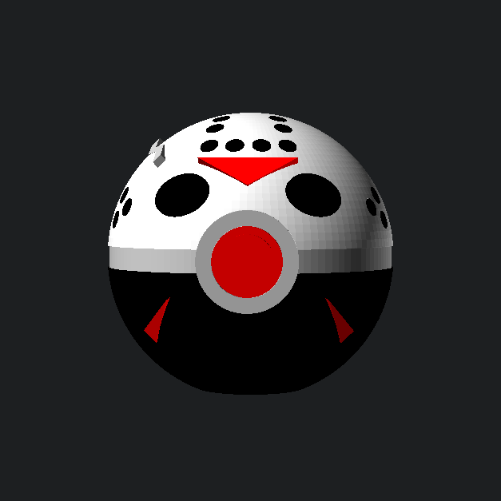

# Slasher Spheres: Jason Voorhees Sphere

A multi-part, support-free display sphere merging classic creature-catching geometry with Jason Voorhees' battle-worn hockey mask. Engineered in OpenSCAD for glue-free friction assembly, featuring an integrated flat display base, precision chip inserts, and an anti-twist rectangular core peg.

<!-- markdownlint-disable MD033 -->

    

<!-- markdownlint-enable MD033 -->

## 📥 Download & Print Profiles

Pre-configured print files and component meshes are organized in the [`models/`](./models/) directory:

- **Shell Components:**
  - `models/jason-ball-top.stl` — Top hemisphere with recessed mask pockets and axe notch.
  - `models/jason-ball-bottom.stl` — Bottom hemisphere with integrated flattened display base.
  - `models/jason-ball-ring.stl` — Center equatorial dividing band.
- **Internal Core & Button:**
  - `models/jason-ball-filler.stl` — Heavy-duty rectangular alignment peg.
  - `models/jason-ball-front-ring.stl` — Button bezel housing.
  - `models/jason-ball-button.stl` — Stepped center actuator.
- **Detail Chips (Mask Features):**
  - `models/jason-ball-chips-black.stl` — Eye cuts and perimeter ventilation hole inserts.
  - `models/jason-ball-chips-red.stl` — Brow and cheek chevron inserts.
  - `models/jason-ball-chips-silver.stl` — Axe-notch battle damage inlay.

Also available on creator platforms:

- [MakerWorld](https://makerworld.com/)
- [Printables](https://www.printables.com/)
- [Creality Cloud](https://www.crealitycloud.com/)

## 🖨️ Recommended Print Settings

### Structural & Shell Settings

- **Material:** PLA or PETG.
- **Layer Height:** 0.20 mm.
- **Wall Generator:** **Arachne (Mandatory)** to resolve thin walls around recessed chip pockets.
- **Wall Loops:** 3–4 walls.
- **Infill:** 15% Gyroid for hemispheres; **100% solid infill for detail chips** to prevent snapping during insertion.
- **Seam Position:** **Back / Rear**. Critical for keeping front mask surfaces and mating lips free from seam zits.
- **Orientation:** Print hemispheres and the center ring flat-face down on the build plate. Print the rectangular core peg laying flat on its side for maximum shear strength.
- **Supports:** None required.
- **Elephant Foot Compensation:** **0.15 mm**. Essential to ensure the 0.05 mm tolerance chips seat flush without edge filing.

## 🔩 Hardware Required

_100% 3D Printed — No screws, inserts, or adhesives needed under calibrated tolerances._

## 🛠️ Customizing with OpenSCAD

Adjust tolerances or export custom configurations using `jason-ball.scad`. Saved Customizer parameter profiles are stored alongside the script in `jason-ball.json`.

**Key Variables:**

- `PART` — Target component export mode.
- `mechanical_clearance` — Clearances for the core peg, center ring, and button housing (Default: `0.05 mm`).
- `chip_clearance` — Mask detail pocket clearance (Default: `0.05 mm`).
- `SHOW_CRACK` — Toggles the battle-worn axe damage notch on the top hemisphere (`true` / `false`).

## 🧩 Assembly Instructions

1. **Insert Face Chips:** Press the black eye/vent plugs, red chevrons, and silver crack inlay into the top hemisphere pockets. They are designed to sit 0.05 mm proud of the mask surface.
2. **Assemble Core:** Press the rectangular filler peg into the socket of the flattened bottom hemisphere.
3. **Seat Band & Top Shell:** Slide the center equatorial ring over the core peg, then press the top hemisphere down over the exposed peg until fully seated.
4. **Install Button:** Press the center button into the front bezel ring, then press the combined button assembly into the front equator socket.
5. **Troubleshooting:**
   - **Too Tight?** Check for first-layer elephant foot around chip perimeters or decrease outer wall flow by 2%–3%.
   - **Too Loose?** If machine variances cause loose fits, apply a tiny drop of CA glue inside the internal core peg channel.

---

_Disclaimer: This is a fan-art project provided for personal use only. It is not affiliated with, authorized by, or endorsed by the Friday the 13th franchise, New Line Cinema, Pokémon, or Nintendo._

_Part of the [Cold Front Forge](https://github.com/OneBuffaloLabs/ColdFrontForge) open-source collection. Licensed under CC BY-NC-SA 4.0._

_Looking for finished physical prints or custom colors? Visit our shop: [coldfrontforge.etsy.com](https://coldfrontforge.etsy.com)_
