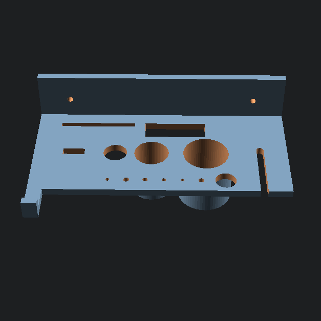

# K2 SE Tool Kit Holder (Official Enclosure Edition)

<!-- markdownlint-disable MD033 -->

    

<!-- markdownlint-enable MD033 -->

A high-precision, side-mounted organizer designed specifically for the **Official Creality K2 SE/K1 SE Enclosure**. This holder utilizes the existing 3.4 mm mounting points on the transparent PC panels to keep your entire maintenance kit organized and upright.

Live Model Page: [Creality Cloud](https://www.crealitycloud.com/model-detail/creality-k2-se-toolkit-organizer-enclosure-mount)

## 📂 Project Structure

- `assets/cad/` — Parametric test plate utility script (`k2-se-test-plate.scad`).
- `assets/media/` — High-resolution installation photos and renders.
- `models/` — Exported print-ready STLs and production 3MF project profiles:
  - `models/tool-holder/` — Main rack mesh and production profile.
  - `models/test-plate/` — Calibration plate for hole spacing checks.
- `k2-se-tool-holder.scad` — Core parametric OpenSCAD source file.
- `README.md` — Technical documentation and hardware guide.
- `LISTING.md` — Platform-agnostic listing copy for creator communities.
- `CREATOR_COMMUNITIES.md` — Platform tags, categories, and publication metadata.

## 🛠 Required Hardware & Compatibility

**🚨 IMPORTANT:** The stock K2 SE is an open-frame printer. This mod **requires** the official enclosure:

- **Required Enclosure:** [Creality Official K2 SE/K1 SE Transparent PC Enclosure](https://www.amazon.com/Creality-Transparent-Temperature-Protective-Customized/dp/B0FSQFJHZ1)
- **Mounting Spacing:** **104.96 mm** (center-to-center).
- **Hardware:**
  - 2x **M3-0.5 x 12mm** Bolts (Flat Head Phillips or Hex).
  - 2x **M3 Hex Nuts**.
  - 2x **M3 Flat Washers** (Highly recommended to protect the transparent PC panels).

## 🖨️ Print Instructions

### Slicer Settings

- **Orientation:** Print with the **backplate flat on the build plate**.
- **Material:** PLA or PETG (PETG recommended for ambient enclosure heat resistance).
- **Wall Loops:** **4 loops**. Solid perimeters around mounting holes and tool slots are critical for long-term durability.
- **Wall Generator:** **Arachne** is mandatory to maintain 0.2 mm precision clearances for the Allen key and nozzle cleaner slots.
- **Infill:** 25% Gyroid.
- **Supports:** **Tree (Auto)** required. Supports should only generate under the hanging cups and the front hook.
- **Brim:** None required on clean PEI or textured beds.

## 🔧 Tool Compatibility

Engineered with tight tolerances to prevent L-shaped tools and accessories from tilting:

- **Glue Stick (25 mm) & Mechanical Grease (19 mm):** Custom-sized drop-in cups.
- **Wrench:** Slide-in front slot with a 4 mm neck groove for a flush fit.
- **Scraper:** Dedicated 42 mm x 3 mm rear slot.
- **Flush Cutters:** 34 mm wide center-back slot.
- **Front Edge Tools:** L-shaped socket wrench (11.2 mm), small screwdriver, 4x Allen keys (1.6 mm, 2.2 mm, 2.5 mm, 3.0 mm), and nozzle cleaning needle.
- **Flash Drive:** 12 mm x 4.5 mm slot designed to catch the plastic housing while the USB-A plug drops through.
- **Accessory Hook:** 8 mm wide hook for hanging calipers or nozzle brushes.

---

_Note: This is an aftermarket modification. Use the included M3 washers on the nut side to distribute clamping pressure and prevent cracking the enclosure panels._
