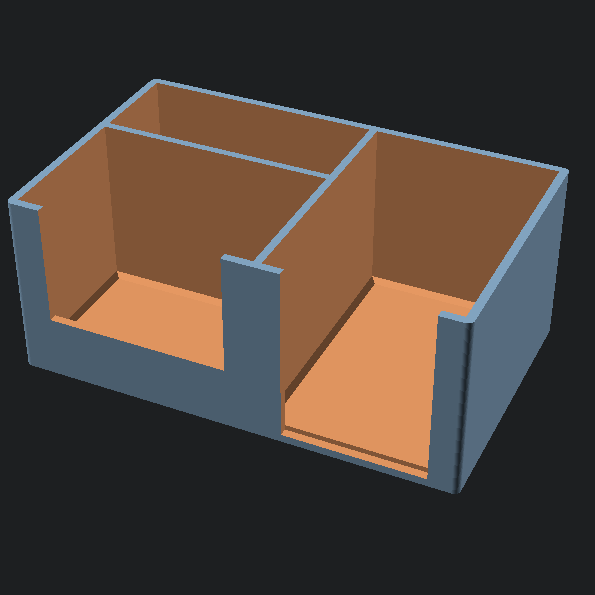

# Cold Snap Desk Caddy

Keep your card station organized and streamline your pack rips, grading submissions, and sales prep.

The **Cold Snap Desk Caddy** keeps all your essential protective supplies neatly separated and within arm’s reach on your desk mat. Built with front cutouts and a stable footprint, it lets you pinch and pull a single sleeve or case without fumbling or creasing corners.

<!-- markdownlint-disable MD033 -->

   

<!-- markdownlint-enable MD033 -->

## 📏 Editions & Sizing

The caddy comes in three versions to match your workflow and print volume:

- **Standard Edition (`cold-snap-desk-caddy.scad`):** Compact 3-stage daily caddy (`170.0mm W x 104.0mm D x 70.0mm H`). Fits penny sleeves, ~35 toploaders, and ~45 semi-rigids. Compatible with nearly all beds (180x180mm+).
- **Pro Station (`cold-snap-desk-caddy-pro.scad`):** Expanded live-breaker station (`171.4mm W x 146.0mm D x 70.0mm H`). Deepened toploader pocket (~70+ capacity), flat penny sleeve bay, semi-rigid bay, and dual rear utility compartments for painter's tape, pull tabs, and Sharpies. Sized to print flat on standard 220x215mm+ beds without rotation.
- **XL Stream Edition (`cold-snap-desk-caddy-xl.scad`):** High-capacity double breaker caddy (`244.4mm W x 146.0mm D x 70.0mm H`). Features massive toploader storage, semi-rigid bay, dual side-by-side flat penny sleeve bays, and dual wide rear tool trays.
  - **Print Bed Notice:** This edition requires a build plate of at least **256 mm × 256 mm** to print squarely flat (or a minimum diagonal of **285 mm** if rotated 45° in your slicer). _Note: The XL model files and parametric scripts are included, but this variant has not been physically test-printed yet due to print bed size limitations on our current machine._

## 📥 Download & Print Profiles

Pre-sliced `.3mf` files and optimized print profiles are available across creator communities:

- [MakerWorld](https://makerworld.com/en/models/3292723-cold-snap-desk-caddy)
- [Printables](https://www.printables.com/model/1839441-cold-snap-desk-caddy)
- [Creality Cloud](https://www.crealitycloud.com/model-detail/cold-snap-desk-caddy)

## ✨ Features

- **Multi-Stage Organization:** Dedicated spots for penny sleeves, semi-rigid holders, standard 35pt toploaders, and stream tools (Pro & XL).
- **Quick-Pull Access:** Recessed front cutouts let you slide or pinch cards out smoothly without bent edges.
- **Stable Footprint:** Wide, low-profile base designed to stay planted on your desk mat even when fully stocked.
- **Debossed Maker's Mark:** Clean Cold Front Forge snowflake debossed flat into the underside (0.8mm crisp shadow depth).

## 📦 Capacity

| Edition         | 35pt Toploaders | Semi-Rigids (Card Savers) | Penny Sleeves | Stream Tool Bays                   |
| :-------------- | :-------------- | :------------------------ | :------------ | :--------------------------------- |
| **Standard**    | ~35             | ~45                       | 100+ (1 bay)  | —                                  |
| **Pro Station** | ~70+            | ~45                       | 100+ (1 bay)  | 2 split rear bays (markers, tape)  |
| **XL Stream**   | ~70+            | ~45                       | 200+ (2 bays) | 2 wide rear bays (tools, supplies) |

## 🖨️ Recommended Print Settings

- **Material:** PLA, PLA+, or PETG (PETG recommended if sitting near warm electronics or direct sunlight)
- **Layer Height:** 0.20mm
- **Wall Loops (Perimeters):** 3–4 for solid, sturdy pocket dividers
- **Infill:** 15% Gyroid or Grid
- **Supports:** None required (prints flat on base)
- **Brim:** Not needed on a clean, level bed

## 🔩 Hardware Required

100% 3D Printed — No extra hardware needed!

## 🛠️ Customizing with OpenSCAD

Because this design is fully parametric, you can easily tweak pocket depths, clearances, or wall thicknesses to fit thicker supplies (like 55pt–130pt toploaders or magnetic one-touches) using the included `.scad` files.

**Key Variables You Can Change:**

- `BOX_W` - Total overall width across X
- `BOX_D` - Total overall depth across Y
- `RIGHT_BAY_W` - Width of the penny sleeve bay(s)
- `FRONT_BAY_D` / `LEFT_FRONT_D` - Depth of the front toploader compartment
- `ENABLE_LOGO` - Toggle base debossed logo rendering on/off (Default: `true`)
- `LOGO_DEBOSS_D` - Depth of base deboss cut (Default: `0.8mm`)

_To modify, open any `.scad` file in [OpenSCAD](https://openscad.org/), adjust the variables at the top of the script, press `F6` to render, and `F7` to export your new STL._

## 🧩 Assembly Instructions

1. Remove the print from the build plate — ready to use immediately with zero post-processing.
2. Load your supplies into their designated bays:
   - Front-left: Standard 35pt toploaders
   - Rear-left: Semi-rigid submission holders
   - Front-right: Penny sleeves (single bay on Standard/Pro, dual bays on XL)
   - Rear-right (Pro/XL): Markers, tape rolls, pull tabs, and utility snips
3. Place right next to your desk mat or sorting tray for quick, clutter-free ripping and grading prep.

_(Cards, sleeves, and cases shown in photos are for demonstration purposes only and not included.)_

---

_Part of the [Cold Front Forge](https://github.com/OneBuffaloLabs/ColdFrontForge) open-source collection. Licensed under CC BY-NC-SA 4.0._

_Looking for finished physical prints or custom colors? Visit our shop: [coldfrontforge.etsy.com](https://coldfrontforge.etsy.com)_
