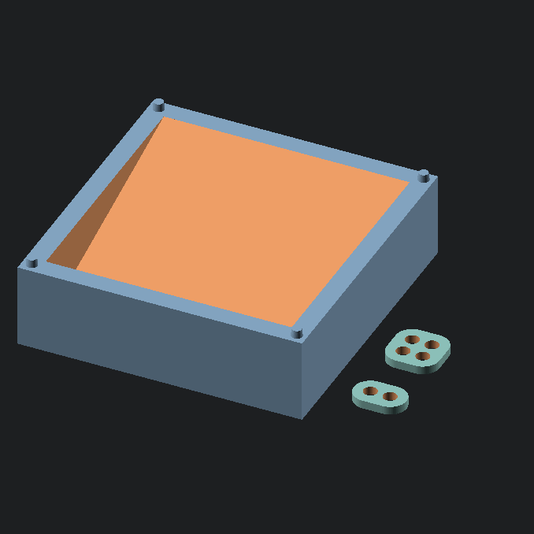

# Cold Snap Sorter

A modular, interlocking, and stackable TCG sorting bay designed to keep your desk organized during pack openings, bulk prep, and collection inventorying.

## 📥 Download & Print Profiles

Pre-sliced `.3mf` files and optimized print profiles are available across creator communities:

- [MakerWorld](https://makerworld.com/)
- [Printables](https://www.printables.com/)
- [Creality Cloud](https://www.crealitycloud.com/)

## 🖨️ Recommended Print Settings

Optimized for fast, economical batch printing:

- **Material:** PLA, PLA+, or PETG
- **Layer Height:** 0.20 mm
- **Infill:** 10–15% (Grid or Gyroid)
- **Wall Loops (Perimeters):** 3
- **Supports:** None (100% support-free geometry)
- **Brim:** Not required (large flat footprint ensures solid bed adhesion)

## 🔩 Hardware Required

100% 3D Printed — No extra hardware, screws, or glue needed.

## 🛠️ Customizing with OpenSCAD

The Cold Snap Sorter is fully parametric. Open `cold-snap-sorter.scad` in [OpenSCAD](https://openscad.org/) to adjust key dimensions for your card protectors or print setup.

**Key Variables You Can Change:**

- `PART` — Choose export target: `"bay"`, `"single_link"`, `"quad_link"`, `"links"`, or `"both"`
- `CARD_W` — Inner cavity width (Default: `70.0mm`, comfortably clears raw cards, penny sleeves, and outer deck sleeves)
- `CARD_L` — Front-to-back tray length (Default: `72.0mm`, allows standard 88 mm cards to overhang the back for quick grabbing)
- `BOX_H` — Overall unit height (Default: `24.0mm`)
- `RAMP_FRONT_H` — Minimum floor height at the front lip (Default: `5.0mm`)
- `RAMP_BACK_H` — Maximum floor height at the rear (Default: `24.0mm`, flush with the top rim)
- `PEG_R` — Stacking and linking peg radius (Default: `1.6mm`)
- `SOCKET_TOL` — Radial clearance for underside sockets and link brackets (Default: `0.35mm`)

_To modify: open `cold-snap-sorter.scad`, update parameters at the top, hit `F5` to preview, `F6` to render, and `File -> Export -> STL`._

## 🧩 Assembly Instructions

1. **Standalone Sorting:** Place individual Sorter Bays on your desk. The low-profile ramp holds cards at a slant with the top edge extending over the back for quick pull-and-sort workflows.
2. **Side-by-Side Linking (1x2):** Push two Sorter Bays flush against each other. Press a `Frost Link (1x2)` down over the two adjacent corner pegs to lock them into a row or column.
3. **4-Way Cluster Linking (2x2):** Arrange four bays in a 2×2 grid. Press the `Frost Quad Link (2x2)` over the four touching center corner pegs to lock the entire junction flat.
4. **Vertical Stacking:** When not in use, stack bays vertically by aligning the underside corner sockets over the top corner pegs of the bay below.

---

_Part of the [Cold Front Forge](https://github.com/OneBuffaloLabs/ColdFrontForge) open-source collection. Licensed under CC BY-NC-SA 4.0._

_Looking for finished physical prints or custom colors? Visit our shop: [coldfrontforge.etsy.com](https://coldfrontforge.etsy.com)_
