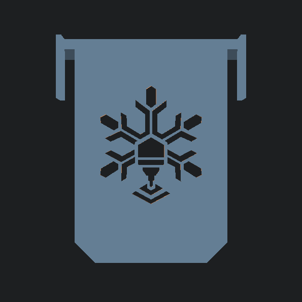

# Cold Snap Wedge — Vertical TCG Card Stopper & Box Partition Divider

A 3D-printed card stopper and row divider designed for multi-row corrugated bulk storage boxes (such as standard BCW 3,200 and 5,000-count boxes, or this [Example Box](https://www.walmart.com/ip/Monster-Trading-Card-Storage-Box-5-Row-Holds-3950-count-Cards-card-box-organizer-Sports-Card-Trading-Card-TCG-Magic-Mtg-Cards-Baseball-card-storage/7570263861)). An integrated saddle hook clips directly over the internal cardboard partition wall, locking the divider firmly in place to keep partial rows upright and prevent cards from sliding or slumping.

## 🖨️ Recommended Print Settings

To get the best results, especially if this is a functional part, we recommend the following settings:

- **Material:** PLA, PLA+, or PETG
- **Layer Height:** 0.20mm
- **Infill:** 15%–20% (Gyroid or Grid)
- **Wall Loops (Perimeters):** 4-5
- **Supports:** None required (prints flat on the front plate)
- **Brim:** Not necessary unless you experience bed adhesion issues

## 🔩 Hardware Required

100% 3D Printed - No extra hardware needed!

## 🛠️ Customizing with OpenSCAD

Because this design is parametric, you can easily adjust the dimensions to fit your specific needs using the included `.scad` file.

**Key Variables You Can Change:**

- `plate_width` - Divider plate width across the row channel (Default: 69.0mm, sized for standard 70mm box rows)
- `plate_height` - Total vertical height of the divider (Default: 96.0mm)
- `hook_side` - Selects which side the partition hook extends from (`-1` for Left, `1` for Right)
- `wall_gap` - Slot width straddling the cardboard partition (Default: 5.8mm, fits ~5.0mm corrugated walls)
- `bridge_depth` - Distance the top saddle spans across the partition edge (Default: 5.0mm)
- `hook_drop_length` - How far the retaining hook flange extends into the adjacent row channel (Default: 18.0mm)
- `hook_leg_height` - Vertical span of the outer hook leg down the divider side (Default: 38.0mm)
- `enable_logo_cutout` - Toggles the Cold Front Forge snowflake logo cutout (`true` / `false`)

_To modify, simply open the file in [OpenSCAD](https://openscad.org/), change the variables at the top of the script, press `F6` to render, and `F7` to export your new STL._

## 🧩 Usage Instructions

1. **Installation:** Align the divider upright in the desired card channel. Slip the upper saddle clip over the internal cardboard row partition so the outer retaining leg drops into the adjacent channel.
2. **Card Stopper Function:** Push the divider flush against your card stack. The friction fit over the partition prevents the divider from tilting or creeping forward under card weight.
3. **Labeling:** The top flat edge provides ample surface area for standard 9mm or 12mm label maker tape.

---

_Part of the [Cold Front Forge](https://github.com/OneBuffaloLabs/ColdFrontForge) open-source collection. Licensed under CC BY-NC-SA 4.0._

_Looking for finished physical prints or custom colors? Visit our shop: [coldfrontforge.etsy.com](https://coldfrontforge.etsy.com)_
